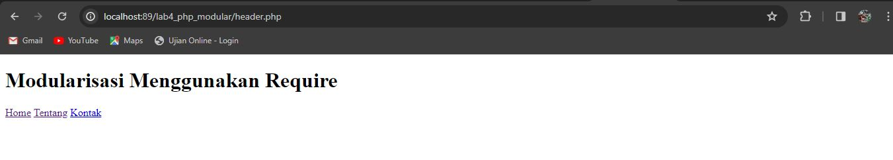
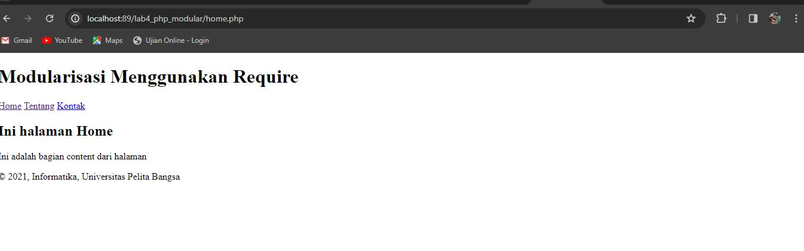
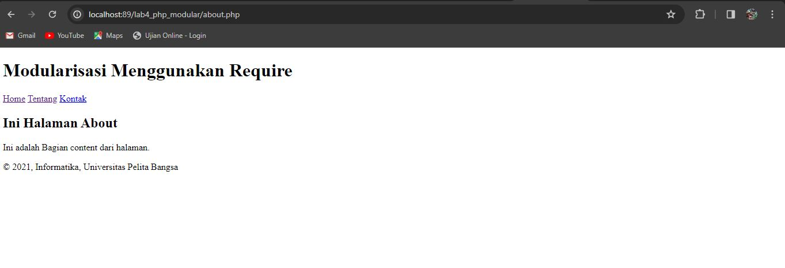
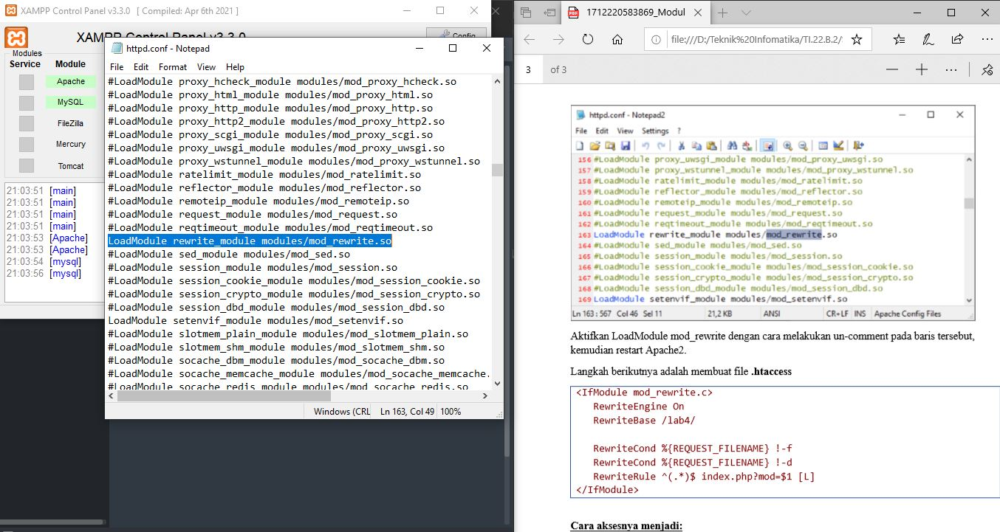

#  Praktikum 4: PHP Modular 

* Nama :Dwi HERIYANTO
* Nim : 312210541
* Kelas : TI.22B2

> Langkah-langkah Praktikum

>  Buat file baru dengan nama header.php dan inputnya

```py
<!DOCTYPE html>
<html lang="en"> 
<head>    
	<meta charset="UTF-8">    
	<title>Contoh Modularisasi</title>    
	<link href="style.css" rel="stylesheet" type="text/stylesheet" media="screen" /> 
</head> 
<body>    
	<div class="container">        
		<header>            
			<h1>Modularisasi Menggunakan Require</h1>
			</header>        
			<nav>            
				<a href="home.php">Home</a>            
				<a href="about.php">Tentang</a>            
				<a href="kontak.php">Kontak</a>        
			</nav>
```

* output dari Header



> Buat file baru dengan nama footer.php dan inputnya :

```py
<footer>
	<p>&copy; 2021, Informatika, Universitas Pelita Bangsa</p>
</footer>	
</div>
</body>
</html>

```
* outputnya dari footer


> Buat file baru dengan nama home.php dan Inputnya :

```py

<?php require('header.php'); ?>
<div class="content">
	<h2>Ini halaman Home</h2>
	<p>Ini adalah bagian content dari halaman</p>
</div>
<?php require('footer.php'); ?>

```

* Hasil Output dari Home



> Buat file baru dengan nama about.php  dan Inputnya :

```py
<?php require ('header.php'); ?>

<div class="content">
	<h2>Ini Halaman About</h2>
	<p>Ini adalah Bagian content dari halaman.</p>
</div>
<?php require('footer.php'); ?>

```
* Output dari About.php



> Membuat Routing Routing digunakan untuk mempermudah akses halaman web agar SEO Friendly. 
Langkah awal adalah menyiapkan file utama (index.php) yang berisi routing untuk mengakses banyak halaman.

> Contohnya:

*  Halaman Home ( http://localhost/lab4/index.php?mod=home )
* Halaman About ( http://localhost/lab4/index.php?mod=about ) 

> Buat file baru dengan nama index.php dan inputnya :

```py
<?php
$mod = $_REQUEST['mod'];

switch ($mod) {
	case "home":
		require ("home.php");
		break;
	case "about":
		require("about");
		break;

}
?>
```

> Aktivasi mod_rewrite (.htaccess) Mod_rewrite digunakan untuk mengubah URL dari query string menjadi SEO Friendly.  
Langkah awal yang harus disiapkan adalah aktivasi mod_rewrite pada webserver Apache2 pada configurasi httpd.conf




> Aktifkan LoadModule mod_rewrite dengan cara melakukan un-comment pada baris tersebut, kemudian restart Apache2.

 * Langkah berikutnya adalah membuat file .htaccess

```py
<IfModule mod_rewrite.c>    RewriteEngine On    RewriteBase /lab4/ 
 
   RewriteCond %{REQUEST_FILENAME} !-f    RewriteCond %{REQUEST_FILENAME} !-d    RewriteRule ^(.*)$ index.php?mod=$1 [L] </IfModule> 
```
* Input Restar dari Apache2


-----
````
----- SEKIAN DAN TERIMAKASIH ----- 